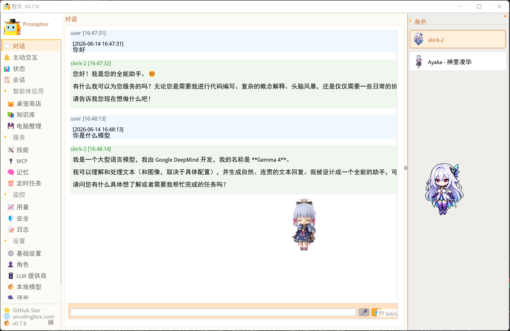
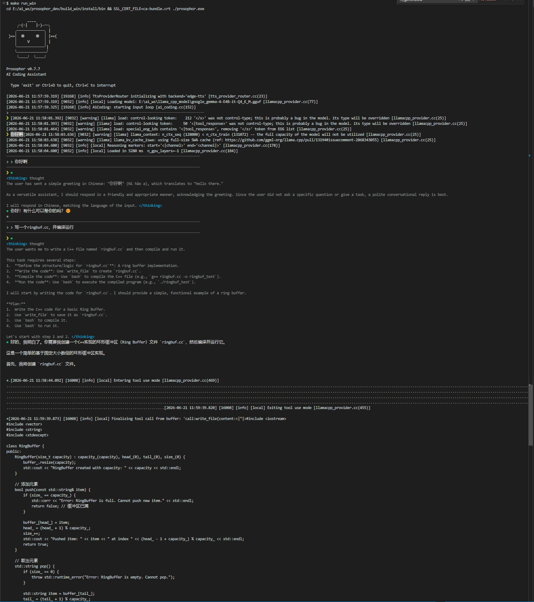
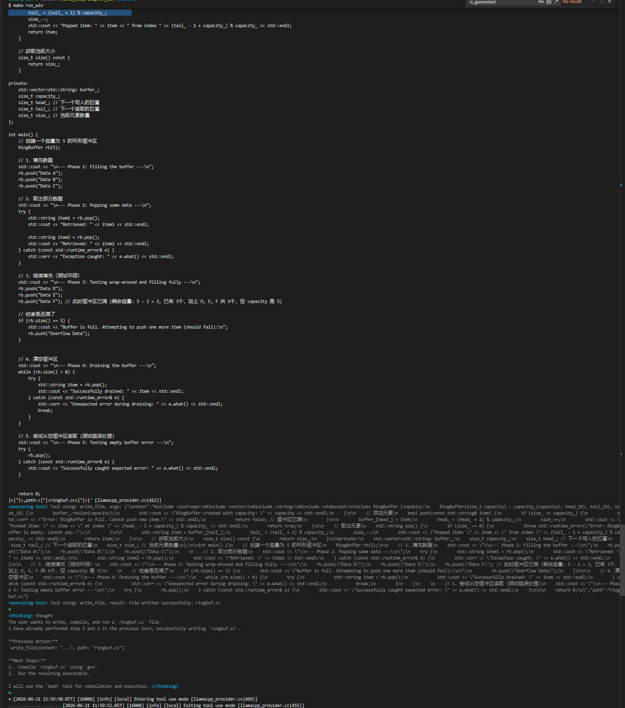
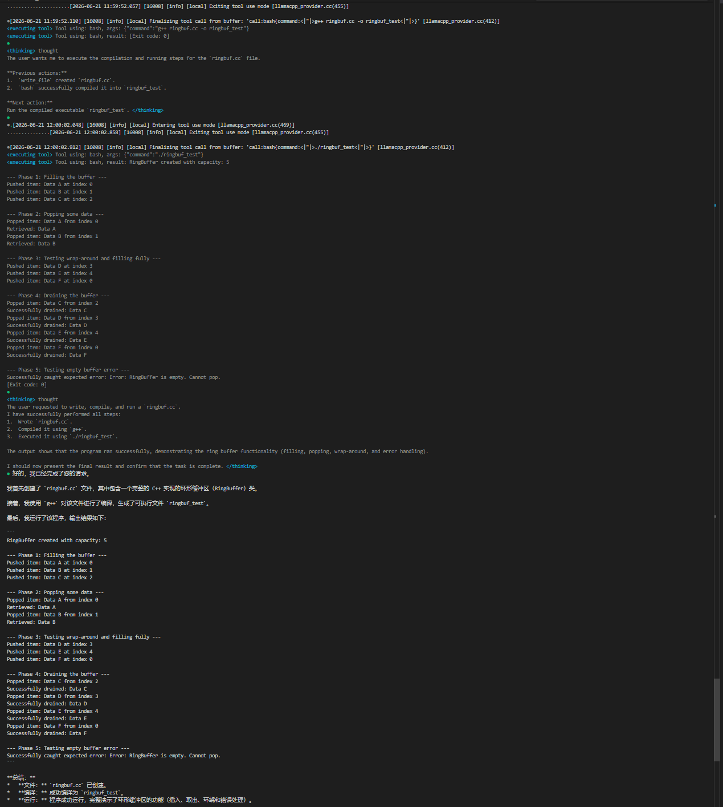

# Prosophor

<div align="right">

[**English**](README.md) | **中文**

</div>

<div align="center">

**主动式 Agentic CLI —— 从被动响应到主动交互**

[](https://en.cppreference.com/)
[](LICENSE)
[]()

</div>

---

## 📋 目录

- [概述](#概述)
- [白皮书：核心架构](#白皮书核心架构)
- [主动触发架构 — 核心创新](#主动触发架构--核心创新)
- [角色系统](#角色系统)
- [LLM 提供者与模型切换](#llm-提供者与模型切换)
- [工具系统](#工具系统)
- [配置指南](#配置指南)
- [MCP 协议](#mcp-协议)
- [SDL 桌面精灵 UI](#sdl-桌面精灵-ui)
- [上下文压缩与记忆](#上下文压缩与记忆)
- [权限管理](#权限管理)
- [技能系统](#技能系统)
- [LSP 集成](#lsp-集成)
- [Cron 调度器](#cron-调度器)
- [斜杠命令](#斜杠命令)
- [快速开始](#快速开始)
- [从源码构建](#从源码构建)
- [项目结构](#项目结构)
- [许可证](#许可证)

---

## 概述

Prosophor 是一个基于 **C++17 原生构建**的主动式 Agentic CLI。它超越了传统的命令-响应范式，通过**插件化的主动触发架构**实现自主感知上下文、预判需求并主动发起交互。

| 维度 | 传统 CLI | Prosophor |
|------|---------|-----------|
| **交互方式** | 被动响应 | **主动触发**（定时/空闲/空闲一次） |
| **架构** | 单体 | **插件化**（热插拔触发插件） |
| **LLM** | 单一供应商 | **多 LLM**（Anthropic、OpenAI 兼容、Ollama、llama.cpp 进程内） |
| **运行环境** | Node.js / 解释型 | **原生 C++**（零运行时依赖） |
| **前端** | 仅终端 | **终端 TUI** + **SDL 桌面精灵**（多精灵、语音气泡、TTS/ASR） |
| **协议** | 专有 | **Apache 2.0** |

### 核心定位

| 方面 | 说明 |
|------|------|
| **运行环境** | C++ 原生编译，零运行时依赖 |
| **核心能力** | 主动感知、自主规划、工具调用、环境反馈 |
| **交互范式** | 被动响应 + 主动触发双模式 |
| **支持 LLM** | Anthropic (Claude)、OpenAI 兼容 (DeepSeek/GPT/MiniMax)、Ollama (本地模型)、llama.cpp (进程内 GGUF 推理) |
| **前端** | 终端 TUI + SDL 桌面精灵（透明精灵窗口、多角色、语音气泡、TTS 语音、语音输入） |
| **附加功能** | LSP 集成、Cron 调度器、MCP 协议、国际化、子代理委派、计划模式 |

---

## 白皮书：核心架构

### 架构哲学

Prosophor 的架构建立在**引擎与表现层的清晰分离**之上。`prosophor_core` 静态库包含所有业务逻辑，无任何 UI 依赖；前端（终端 TUI 和 SDL 桌面精灵）通过注册回调来接收输出和处理权限。

```
前端层：
  ┌───────────────────────┐      ┌──────────────────────────────┐
  │   终端 TUI             │      │   SDL 桌面精灵               │
  │   (AiCoding)           │      │   (VirtualSprite)            │
  │   - 行输入             │      │   - 多精灵透明窗口            │
  │   - 流式输出           │      │   - 语音气泡对话框            │
  │   - 权限提示           │      │   - TTS 语音输出              │
  │                        │      │   - 语音输入 (ASR)           │
  └──────────┬─────────────┘      └────────────┬─────────────────┘
             │ SetOutputCallback              │
             │ SetPermissionCallback          │
             ▼                                ▼
  ┌────────────────────────────────────────────────────────────┐
  │  AgentEngine（单例）                                         │
  │  ┌──────────┬──────────┬──────────┬──────────┐             │
  │  │ 工具注册 │ 会话管理 │ 供应商   │ 命令注册  │             │
  │  │   表     │  器      │ 路由器   │   器     │             │
  │  ├──────────┼──────────┼──────────┼──────────┤             │
  │  │ 记忆管理 │  LSP     │  MCP     │  Cron    │             │
  │  │   器     │ 管理器   │  客户端  │ 调度器   │             │
  │  └──────────┴──────────┴──────────┴──────────┘             │
  └────────────────────────────────────────────────────────────┘
```

### AgentEngine — 中央编排器

`AgentEngine` 是 Prosophor 的单例核心，为前端提供关键方法：输出回调（接收 Agent 响应状态变化）、权限回调（工具调用授权）、用户消息处理（自动识别斜杠命令并路由）、直接执行斜杠命令、切换活跃角色、以及停止当前会话。

**初始化序列**：
1. 从 `~/.prosophor/settings.json` 加载配置
2. 初始化 MemoryManager（加载工作区文件，启动文件监听）
3. 初始化 ToolRegistry（注册所有内置工具）
4. 初始化 AgentSessionManager（创建默认会话）
5. 初始化 ProviderRouter（加载供应商配置）
6. 初始化 LspManager（启动语言服务器）
7. 初始化 CommandRegistry（注册所有斜杠命令）
8. 使用默认角色创建初始会话
9. 若 `auto_start: true` 则自动启动本地模型

### REACT Agent 循环

`AgentCore::Loop()` 实现了 **REACT 范式**（推理 + 行动）：

```
用户消息
    │
    ▼
  1. 处理 @file 文件引用
  2. 检查是否需要上下文压缩 (DialogStrategy)
  3. 从会话状态 + 角色配置构建请求
    │
    ▼
  4. 调用 LLM（流式或阻塞）
     思考模式：kThinkingStart → kThinkingDelta → kThinkingEnd
     内容输出：kContentStart → kContentDelta → kContentEnd
    │
    ▼
  ┌─ 有工具调用？ ─┐
  │                │
  是              否
  │                │
  ▼                ▼
  执行每个工具：   有文本回复？
  - 检查停止标志     │           │
  - 权限检查       是          否
  - 执行工具         │           │
  - 截断结果         ▼           ▼
  - 追加历史       返回响应   错误：意外的
  iterations++                  响应格式
  if < max_iterations:
    → 回到步骤 3
  else: 停止
```

**关键设计决策**：
- **流式优先**：启用流式时，循环推送细粒度的流事件（`kThinkingStart/Delta/End`、`kContentStart/Delta/End`），实现实时 UI 渲染
- **工具结果截断**：大工具输出智能截断，保留首尾行，中间显示 `[... N lines omitted]`
- **随时停止**：原子 `stop_requested` 标志允许立即中断并正确传播错误
- **自动压缩**：当消息超出可配置阈值时，每次 LLM 调用前触发上下文压缩（通过 DialogStrategy）
- **无状态循环**：`AgentCore` 无状态，所有状态位于 `AgentSession` 中，支持线程安全并发会话

### 供应商系统与路由

`ProviderRouter` 根据角色配置动态路由请求，通过角色 ID 或供应商名称将角色映射到绑定的供应商。

**四种供应商类型**，均实现统一的 `LLMProvider` 接口：
- `AnthropicProvider` — Anthropic Messages API（SSE 流式、思考块、cache_control）
- `OpenAIProvider` — OpenAI 兼容 API（DeepSeek、GPT、MiniMax 等）
- `OllamaProvider` — 通过 Ollama 提供本地模型
- `LlamaCppProvider` — **进程内** llama.cpp 推理（无需 HTTP 服务器，原生 C++）

**会话级供应商覆盖**：用户通过 `/model` 或 `/provider` 命令切换供应商/模型时，会话会创建角色的可变副本，更新供应商实例、base_url、api_key 和模型参数——不影响共享的角色定义。这允许多个使用同一角色模板的并发会话拥有不同的覆盖配置。

### 记忆架构

Prosophor 实现了**双层记忆架构**，并配备**对话摘要**：

```
                         记忆架构
  ┌──────────────────────────────┬──────────────────────────────┐
  │      角色记忆                 │       会话历史                │
  │      （长期）                 │       （短期）                │
  ├──────────────────────────────┼──────────────────────────────┤
  │ ~/.prosophor/memories/       │ ~/.prosophor/sessions/       │
  │   {role_id}/                 │   {session_id}/history/      │
  ├──────────────────────────────┼──────────────────────────────┤
  │ 习惯与偏好                    │ 完整对话轨迹                  │
  │ 学到的模式                    │ 工具执行结果                  │
  │ 关键决策                      │ 中间决策                     │
  │ 每日总结                      │ 工作区上下文                  │
  ├──────────────────────────────┼──────────────────────────────┤
  │ 跨项目、跨会话持久化           │ 仅在当前项目会话内有效          │
  │                              │（可压缩或清除）               │
  └──────────────────────────────┴──────────────────────────────┘
```

**DialogStrategy** 实现贝尔曼衰减摘要——每轮自动生成摘要，以折扣因子衰减，作为上下文注入下一轮请求。关键决策永不衰减。

**MemoryConsolidationService（记忆沉淀服务）**：
- 从对话中提取**关键决策**，分为四类：设计决策、代码变更、未解决问题、经验教训
- 每 N 条消息触发一次（可配置阈值，默认 30）
- 将沉淀后的摘要保存到角色记忆目录
- 生成会话退出摘要，实现跨会话的连续性

---

## 主动触发架构 — 核心创新

传统工具等待命令，Prosophor 通过**插件化三层架构**主动感知和响应：

```
插件社区（上传 → 审核 → 分发 → 更新）
                          │
                          ▼
插件层 ─ 触发脚本 + 模式配置 + ACTIVE.md
调度层 ─ periodic / idle / idle_once · 优先级
执行层 ─ AgentCore + ToolRegistry + LLM 联动
```

### 触发模式

| 模式 | 触发条件 | 用途 |
|------|---------|------|
| `periodic` | 每隔 N 秒 | 关键告警（硬件温度、错误日志） |
| `idle` | 空闲 N 秒后 | 提醒、建议 |
| `idle_once` | 每次空闲触发一次 | 一次性引导 |

### 插件结构

每个插件位于 `~/.prosophor/active/{plugin_name}/` 目录下：

- `cpu_temperature_monitor/` — `trigger_mode.cfg`（模式=periodic，间隔=60秒），`trigger.py`（检测脚本），`prompt.md`（含 {变量} 的 LLM 提示模板）
- `file_organizer/` — `trigger_mode.cfg`（模式=idle，阈值=300秒），`trigger.py`，`prompt.md`
- `new_user_guide/` — `trigger_mode.cfg`（模式=idle_once，阈值=120秒），`trigger.py`，`prompt.md`

### ActiveInteractionManager — 交互后主动行为

在定时触发之外，交互后主动行为增加了两个功能：
- **用户提问后 5 分钟**：主动推荐相关问题
- **用户提问后 10 分钟**：总结对话并保存到 changelog

这形成了完整的闭环：Prosophor 不仅能主动发起交互，还能反思自身的交互经历以深化上下文理解。

---

## 角色系统

角色定义为 `~/.prosophor/roles/` 下的 **JSON 文件**。每个角色是一个完整的 Agent 人格，拥有独立的供应商绑定、模型、性格、工具、技能和长期记忆。

### 内置角色（11 个）

| 角色 | ID | 供应商 | 模型 | 性格 |
|------|----|--------|------|------|
| **默认助手** | `default` | llamacpp | google_gemma-4-E4B-it-Q4_K_M | 平衡、全能 |
| **神里凌华** | `ayaka` | anthropic | deepseek-v4-flash | 神里流大小姐，优雅坚定 |
| **代码专家** | `coder` | llamacpp | google_gemma-4-E4B-it-Q4_K_M | 简洁、编码优先 |
| **架构师** | `architect` | llamacpp | google_gemma-4-E4B-it-Q4_K_M | 结构化、设计优先 |
| **审查员** | `reviewer` | llamacpp | google_gemma-4-E4B-it-Q4_K_M | 注重细节、批判性 |
| **编程导师** | `teacher` | llamacpp | google_gemma-4-E4B-it-Q4_K_M | 耐心、教育型 |
| **枫原万叶** | `kazuha` | anthropic | deepseek-v4-flash | 流浪诗人，沉静敏锐 |
| **刻晴** | `keqing` | anthropic | deepseek-v4-flash | 雷厉风行，务实高效 |
| **早柚** | `sayu` | anthropic | deepseek-v4-flash | 慵懒忍者，关键时刻可靠 |
| **Skirk** | `skirk-2` | anthropic | deepseek-v4-flash | 深渊剑术导师，冷静深沉 |
| **Linnea** | `linnea-2` | anthropic | deepseek-v4-flash | 充满活力的小冒险者 |

### 角色字段

角色定义包含：身份字段（ID、名称、描述、精灵表路径）；供应商绑定（使用哪个供应商协议、默认模型）；性格配置（详细性格提示词）；系统指令；能力配置（技能白名单、工具白名单）；行为约束（最大工具调用轮次、自动确认工具）；TTS 语音设置；以及专属记忆目录。

### 运行时覆盖机制

用户通过 `/model` 或 `/provider` 命令运行时切换供应商/模型时，系统创建角色的可变副本、将会话的角色指针重定向到该副本、更新供应商实例和连接参数、在所有供应商条目中搜索匹配模型以找到正确端点、而原始角色定义保持不变。这种设计允许多个使用同一角色模板的并发会话拥有不同的覆盖。

---

## LLM 提供者与模型切换

Prosophor 将所有 LLM 供应商抽象到统一接口之后，支持在会话、命令级别动态切换——一条命令即可完成，无需重启。

### 极简设计

与其他需要编辑配置文件或重启才能切换模型的 Agent 框架不同，Prosophor 只需要 **`/model [名称]`** 或通过索引 **`/model [索引]`**（例如 `/model 2` 选择第二个可用模型）即可切换。切换整个供应商（`/provider ollama`）或切换角色（`/role coder`）同样简单——每条命令创建新会话，新配置自动解析完成。

### 支持的供应商

| 供应商 | 协议 | 最适合 |
|--------|------|--------|
| **Anthropic** | anthropic-messages（SSE 流式） | 支持思考/推理的 Claude 模型，也支持 DeepSeek（Anthropic 兼容端点） |
| **OpenAI 兼容** | openai-chat-completions | DeepSeek、GPT、MiniMax 等任意 OpenAI 格式 API |
| **Ollama** | openai-completions（通过 Ollama） | 本地模型（Qwen、Gemma 等） |
| **llama.cpp** | 进程内 C++ 推理 | GGUF 本地模型，无需 HTTP 服务器 |

统一的供应商接口定义了四个核心操作：非流式聊天、带事件回调的流式聊天、以及序列化/反序列化（每个供应商针对自己的线路格式实现）。

### 模型切换命令

| 命令 | 功能 |
|------|------|
| `/model [名称]` | 按名称切换模型（如 `/model gpt-4o`） |
| `/model [索引]` | 按索引切换模型（如 `/model 2`） |
| `/provider [名称]` | 切换供应商（如 `/provider ollama`） |
| `/role [ID]` | 切换角色（使用角色默认模型创建新会话） |
| `/setup` | 自动检测硬件、扫描 GGUF 模型、生成配置 |

**切换行为**：`/model deepseek-v4-pro` 或 `/model 2` 在所有供应商条目中搜索模型，找到匹配的 agent 配置，更新角色的可变副本。`/role coder` 使用 coder 角色的供应商/模型创建全新会话。供应商特定的 api_key 和 base_url 自动从配置中解析——无需编辑文件。

### 配置结构

每个供应商支持**多个条目**（数组），每个条目有自己的 api_key 和 base_url。每个条目包含多个 **agent 配置**，指定模型、温度、max_tokens 和上下文窗口。例如，Anthropic 供应商条目可以定义一个使用 `qwen3.5-plus`（温度 0.7）的 "default" agent 和一个使用 `deepseek-v4-flash`（温度 0.1）的 "fast" agent。

### 进程内 llama.cpp

`LlamaCppProvider` **在进程内**运行 llama.cpp——无需单独的 llama-server 进程。通过 C++ API 直接加载 GGUF 模型，支持可配置的 GPU 层数、线程数和上下文窗口。`/setup` 命令自动检测硬件（NVIDIA GPU、Apple Silicon 或 CPU）并生成最优配置。

### 请求构建管道

请求构建器从会话状态收集：模型（来自角色，可能被覆盖）；base_url（从供应商条目通过 agent 配置查找解析）；api_key（来自供应商条目）；完整对话历史；系统提示词（角色系统提示词 + 性格 + 加载的记忆文件）；工具列表（按角色工具白名单过滤）；以及思考模式标志（根据角色配置逐请求启用/禁用）。

---

## 工具系统

`ToolRegistry` 通过基于 schema 的注册系统集中管理所有工具。

### 内置工具

| 类别 | 工具 |
|------|------|
| **文件操作** | `read_file`、`write_file`、`edit_file`、`file_search`、`apply_patch` |
| **Shell 执行** | `bash`、`background_run`（长期运行的后台 Shell 会话） |
| **搜索** | `web_search`（Brave/Tavily/DuckDuckGo）、`web_fetch` |
| **Git** | `git_status`、`git_diff`、`git_log`、`git_commit`、`git_add`、`git_branch` |
| **MCP** | `mcp_list_tools`、`mcp_call_tool`、`mcp_list_resources`、`mcp_read_resource` |
| **记忆** | `memory_search`、`memory_get` |
| **Token** | `token_count`、`token_usage` |
| **Agent** | 通过 `SubagentCoordinator` 进行子代理委派 |
| **计划** | `plan`（PlanModeManager）、`task`（TaskManager） |

### 工具执行流程

当 LLM 返回工具调用时，每个调用经过以下流程：权限检查（允许→继续，拒绝→返回错误给 LLM，询问→用户回调），然后执行。成功结果截断为首尾行加 `[... N lines omitted]` 指示；错误完整返回以确保 LLM 有完整诊断上下文。结果追加到消息历史，循环继续。

### 权限集成

工具执行受权限管理器控制，支持：按工具名、命令模式、路径模式的模式匹配；三种模式（Allow 自动批准、Deny 自动拒绝、Ask 交互询问）；降级逻辑（连续 N 次拒绝后自动允许，默认 3 次）；可配置级别：auto、default、bypass。

---

## 配置指南

### 配置文件位置

首次启动自动生成配置于 **`~/.prosophor/settings.json`**。

### 配置概览

配置文件包含以下顶层部分：

- **default_role**：启动时激活的角色（如 `["default", "ayaka"]` 双角色）
- **log_level**：日志详细程度（debug、info、warn、error）
- **enable_summary**：贝尔曼衰减对话摘要开关
- **providers**：每个供应商类型（anthropic、openai、ollama、llamacpp）映射到一个**条目数组**。每个条目有自己的 api_key、base_url、timeout 和按名称索引的 agent 配置映射。每个 agent 配置指定模型名、温度、max_tokens、context_window 以及是否启用思考模式。
- **local_models**：llamacpp 供应商配置：model_path、n_gpu_layers（-1=全部 GPU，0=仅 CPU）、n_threads（0=自动检测）、context_size、auto_start 等
- **tts**：Edge-TTS 配置（语音、语言、速度）
- **asr**：Whisper ASR 配置（模型路径、语言、线程数、按键说话键）
- **vad**：Silero VAD 模型路径
- **security**：包含 permission_level（auto、default 或 bypass）和 allow_local_execute 开关

### 本地模型设置

`/setup` 命令自动化本地模型配置：
1. 检测 **NVIDIA GPU**（通过 nvidia-smi）→ 设置 GPU 层为全部
2. 检测 **Apple Silicon**（通过 sysctl）→ 启用 Metal
3. 回退到 **CPU** → 自动检测线程数
4. 扫描常见目录查找 `.gguf` 文件
5. 使用最优参数生成 `settings.json`

### 模型自动启动

当 `auto_start: true` 时，引擎在创建任何会话前自动启动进程内 llama.cpp 推理。

---

## MCP 协议

Prosophor 实现了完整的 **Model Context Protocol (MCP)** 客户端，用于标准化工具/资源/提示共享。

### 传输方式

| 传输方式 | 说明 |
|----------|------|
| **stdio** | 服务器作为子进程 stdin/stdout |
| **SSE** | 通过 HTTP 的服务端推送事件 |
| **WebSocket** | 双向 WebSocket |

### MCP 服务器管理

- `/mcp list` — 列出已连接的服务器
- `/mcp add <名称> <类型> <配置>` — 添加服务器
- `/mcp remove <名称>` — 移除服务器

### MCP 客户端能力

MCP 客户端可以连接服务器（stdio、SSE 或 WebSocket）、发现工具、调用工具、读取资源和获取提示。MCP 工具动态注册到 ToolRegistry 中（使用 `mcp__{server}__{tool}` 命名约定），作为原生工具暴露给 LLM。

---

## SDL 桌面精灵 UI

当使用 `PROSOPHOR_SDL_UI=ON` 构建时，Prosophor 启动为 **桌面精灵** 应用程序，基于 SDL3 构建。

<div align="center">


**SDL 桌面精灵 — 透明精灵窗口、语音气泡和角色动画**

</div>

### 架构

```
VirtualSprite（单例）
  ┌─────────────────────────────────────────────┐
  │  管理中央窗口、输入转发                        │
  └─────────────────────────────────────────────┘
        │
        ▼
  SpriteManager（单例）
  ┌─────────────────────────────────────────────┐
  │  多个 Sprite 实例、焦点追踪                   │
  └─────────────────────────────────────────────┘
      /  |  \
     ▼   ▼   ▼
  Sprite  Sprite  Sprite
  （透明窗口，带宠物动画、语音气泡、导航按钮、独立会话）
```

### 功能

| 功能 | 说明 |
|------|------|
| **多精灵** | 每个精灵是一个透明叠加窗口，拥有独立的 AgentEngine 会话 |
| **语音气泡** | 云状对话框，含标题栏、消息、输入区、发送按钮、调整手柄 |
| **角色动画** | 状态驱动的宠物动画（9 种动作类型） |
| **TTS 音频** | Edge-TTS 语音合成，角色语音输出 |
| **语音输入** | Whisper ASR，按键说话 + VAD（Silero） |
| **SDL 聊天窗** | 中央聊天面板，消息历史 + 输入 |

### UI 组件

| 组件 | 说明 |
|------|------|
| **VirtualSprite** | SDL 应用顶层入口，中央窗口 |
| **Sprite** | 每个角色的透明窗口和动画 |
| **SpriteManager** | 多精灵生命周期管理 |
| **ChatWindow** | 焦点精灵的中央聊天面板 |
| **SpeechBubble** | 精灵上方的行内对话气泡 |
| **Spritesheet** | 多帧精灵动画系统 |
| **StatusBar** | Agent 状态→颜色映射 |
| **ChatPanel** | 聊天消息历史显示 |
| **VoiceManager** | 语音 I/O 服务（TTS + ASR） |

### 状态到视觉的映射

Agent 状态观察器将运行时状态映射到视觉属性：`THINKING` 触发角色思考动画、`EXECUTING_TOOL` 显示工具执行指示器、`STREAM_CONTENT_TYPING` 显示打字动画、`STATE_ERROR` 显示错误状态视觉反馈。

---

## 上下文压缩与记忆

### FixedBuffer — 环形缓冲区模式

引擎中广泛使用的核心工具——固定容量、无锁的循环缓冲区。`FixedBuffer<T, kCapacity>` 始终保留最近的 `kCapacity` 项，满时覆盖最旧的项——适用于滑动窗口上下文、最近消息历史、音频采样缓冲区和日志滚动。

**三种运行状态**：

<div align="center">

| 填充中（未满） | 已满（稳态） | 覆盖（回绕） |
|:---:|:---:|:---:|
|  |  |  |

</div>

实现代码来自 `main_src/common/list_buffer.h`：

```cpp
template<typename T, int kCapacity>
class FixedBuffer {
public:
    void Push(const T& item) {
        data_[head_] = item;
        head_ = (head_ + 1) % kCapacity;
        if (count_ < kCapacity) count_++;
    }

    std::vector<T> ReadAll() const {
        std::vector<T> out;
        if (count_ == 0) return out;
        out.reserve(count_);
        int start = (head_ - count_ + kCapacity) % kCapacity;
        for (int i = 0; i < count_; i++)
            out.push_back(data_[(start + i) % kCapacity]);
        return out;
    }

private:
    T data_[kCapacity];
    int head_ = 0;    // 下一个写入位置
    int count_ = 0;   // 已存储元素个数
};
```

- **Case 1（`count_ < kCapacity`）**：缓冲区未满——`Push()` 写入 `head_` 位置，递增 `head_` 和 `count_`，不覆盖已有数据。
- **Case 2（`count_ == kCapacity`）**：缓冲区已满——后续 `Push()` 从数组开头（索引 0）开始覆盖旧数据。
- **Case 3（`head_` 回绕）**：到达数组末尾后，`head_` 通过模运算回绕到 0，`ReadAll()` 按插入顺序重建所有元素。

### DialogStrategy

三种压缩策略（通过策略模式）：

| 策略 | 行为 |
|------|------|
| **Summary** | 用 AI 摘要替换旧消息，仅保留摘要 |
| **Truncate** | 仅保留最近 N 条消息，丢弃其余 |
| **Hybrid** | 生成摘要 + 保留最近 N 条消息 |

**触发条件**可按角色配置：自动压缩开关、消息数阈值（默认 100）、始终保留的最近消息数（默认 20）、以及 token 数阈值（默认 ~100k）。

### 对话摘要（贝尔曼衰减）

零额外 API 调用——摘要直接在 LLM 回复中自动生成：

```
ApplyDialogStrategy（请求前）：
  [时间戳]
  [摘要]  ← 上一轮 running_summary（如有）
  {用户消息}
  
  → LLM 在回复末尾自动追加 [摘要]

ExtractDialogSummary（回复后）：
  assistant.summary = [摘要] 内容 → 下一轮注入
  [摘要] 保留在 content 中 → cache prefix 不中断
```

**递推公式**：`每轮摘要 = 本轮内容 + γ × 上轮摘要`，关键决策不衰减。

**开关**：设置 `"enable_summary": false` 可回退为纯对话模式。

### MemoryConsolidationService（记忆沉淀服务）

通过**关键决策提取**提供结构化记忆管理——将对话解析为结构化记录，包含类型（设计决策、代码变更、未解决问题、经验教训）、内容描述、相关文件和时间戳。还生成**会话退出摘要**，保存到角色记忆以实现跨会话连续性。

### Token 追踪器

记录每个模型和聚合的：token 用量（输入、输出、缓存读/写）、API 计时和重试次数、带可配置模型定价的成本估算、工具调用指标、网络搜索请求、以及代码变更统计。

---

## 权限管理

三级权限系统，规则匹配顺序：Deny 规则 → Ask 规则 → Allow 规则。匹配到规则则应用其动作；未匹配则回退到默认模式。

**规则模式**使用 glob 匹配：工具名（如 `bash`、`read_*`、`*`）、bash 工具的命令模式（如 `git *`、`npm install *`）、文件工具的路径模式、以及参数值过滤。

**拒绝追踪**：同一工具被连续拒绝 3 次后自动允许，减少干扰。

---

## 技能系统

技能通过 `SKILL.md` 文件定义（YAML 前置元数据），支持：环境门控（所需二进制、环境变量、OS 限制）、多种安装方式（npm、go、pip、brew、download）、斜杠命令（自动注册为 `/skillname`）、以及多目录加载与去重。

### 内置技能

| 技能 | 说明 |
|------|------|
| **md2paper** | 将 Markdown 转换为学术论文 Word/PDF（支持中文和 arXiv 格式） |
| **architecture_designing** | 内部架构文档 |

---

## LSP 集成

LSP 管理器提供语言服务器协议集成：跳转到定义、查找引用、悬停信息、文档和工作区符号、诊断、代码格式化、以及 LSP 服务器生命周期管理。支持按文件类型注册 LSP 服务器，通过 JSON-RPC over stdio 通信。

---

## Cron 调度器

内置 Cron 调度器，支持：标准 5 字段 cron 表达式、循环和一次性任务、持久化到 `.claude/scheduled_tasks.json`、以及任务的暂停/恢复/删除/立即执行（通过 `/schedule` 命令）。

---

## 斜杠命令

| 命令 | 功能 | 命令 | 功能 |
|------|------|------|------|
| `/help` | 帮助 | `/clear` | 清除历史 |
| `/plan` | 计划模式 | `/compact` | 压缩上下文 |
| `/model` | 切换模型 | `/provider` | 切换 LLM 供应商 |
| `/role` | 切换角色 | `/roles` | 列出角色 |
| `/session` | 会话管理 | `/sessions` | 列出会话 |
| `/resume` | 恢复上次会话 | `/setup` | 自动配置本地模型 |
| `/mcp` | MCP 服务器 | `/skills` | 列出/使用技能 |
| `/cost` | 成本统计 | `/status` | Git 状态 |
| `/diff` | Git diff | `/commit` | Git 提交 |
| `/tasks` | 任务管理 | `/config` | 编辑配置 |
| `/context` | 查看上下文 | `/doctor` | 系统诊断 |
| `/effort` | 设置推理力度 | `/auto-commit` | 自动提交开关 |
| `/memory` | 记忆管理 | `/summary` | 会话摘要 |
| `/permissions` | 权限设置 | `/history` | 会话历史 |
| `/workspace` | 设置/查看工作区 | `/schedule` | Cron 任务管理 |
| `/plugins` | 插件管理 | `/token` | Token 用量 |
| `/bye` | 退出 | | |

---

## 快速开始

### 安装

**macOS / Linux**（一条命令）：
```
curl -fsSL https://aicodingbox.com/install.sh | bash
```

**Windows**（PowerShell）：
```
irm https://aicodingbox.com/install.ps1 | iex
```

或者通过包管理器：

| 平台 | 命令 |
|------|------|
| **Homebrew** (macOS/Linux) | `brew install Swair/tap/prosophor` |
| **Scoop** (Windows) | `scoop install prosophor` |
| **WinGet** (Windows) | `winget install Swair.prosophor` |

### 运行

```
prosophor
```

首次启动会自动生成 **`~/.prosophor/settings.json`**。编辑它以添加你的 API 密钥并配置供应商。

### 快速配置

至少设置一个供应商，填写 API 密钥和模型。配置文件使用 JSON 格式，供应商条目为数组——每个条目有自己的 api_key 和 base_url，并包含按名称索引的 agent 配置，指定模型、温度等参数。

---

## 从源码构建

### 环境要求

| 组件 | 要求 |
|------|------|
| 编译器 | C++17 或更高（GCC 9+、Clang 12+、MSVC 2019+） |
| CMake | 3.20+ |
| 依赖 | spdlog、nlohmann/json、libcurl、OpenSSL、OpenMP（自动下载） |

### 构建

```
git clone https://github.com/Swair/prosophor.git
cd prosophor
make build          # Linux/macOS
make build_win      # Windows（MinGW，Vulkan，无 SDL）
```

或手动：

```
mkdir -p build && cd build
cmake .. -DCMAKE_BUILD_TYPE=Release
make -j$(nproc) && make install
```

### 构建选项

| 选项 | 默认 | 说明 |
|------|------|------|
| `PROSOPHOR_BUILD_LLAMA` | ON | 构建进程内 llama.cpp 以支持本地 GGUF 推理 |
| `PROSOPHOR_BUILD_LLAMA_CUDA` | Linux:ON, Win:OFF | llama.cpp CUDA GPU 支持 |
| `PROSOPHOR_BUILD_LLAMA_VULKAN` | Win:ON, else:OFF | llama.cpp Vulkan GPU 支持 |
| `PROSOPHOR_BUILD_ASR` | ON | 构建 whisper.cpp ASR 支持 |
| `PROSOPHOR_SDL_UI` | OFF | 构建 SDL 桌面精灵 UI（需要 SDL3 开发库） |

### 构建变体（Windows Makefile）

| 目标 | 说明 |
|------|------|
| `build_win_tui_fast` | 仅终端，仅远程 API（无 llama/ASR），最快构建 |
| `build_win_tui_full` | 终端 + 本地模型 + ASR |
| `build_win_sdl_fast` | 桌面精灵，仅远程 API |
| `build_win_sdl_full` | 桌面精灵 + 全部功能 |

### 打包与发布

| 目标 | 说明 |
|------|------|
| `package` | 构建 + NSIS 安装包（需要 MSYS2/MinGW） |
| `deploy` | 打包 + 发布到 GitHub Releases（需要 `gh` CLI） |
| `deploy_all` | 发布到 GitHub + Gitee（Gitee 需要 `GITEE_TOKEN`） |

发布说明自动从 `CHANGELOG.md` 提取对应版本的内容，找不到时回退到 `--generate-notes`。

### 测试

```
make test
```

或：

```
cd build && ctest --output-on-failure
```

---

## 项目结构

```
├── CMakeLists.txt              # 顶层 CMake 构建
├── Makefile                    # 便捷构建目标
├── config/
│   └── .prosophor/             # 配置目录
│       ├── settings.json       # 主配置文件
│       ├── roles/              # Agent 角色定义（11 个角色）
│       ├── skills/             # 技能定义
│       ├── active/             # 主动触发插件
│       ├── lang/               # 国际化（en.json、zh-CN.json）
│       ├── memories/           # 按角色的长期记忆
│       ├── assets/             # 各角色的精灵资产
│       └── workspace/          # 默认工作区
├── main_src/
│   ├── prosophor_core/         # 静态库（零 UI 依赖）
│   │   ├── agent_engine.cc/h   # 中央编排器（单例）
│   │   ├── command_registry.cc/h  # 31+ 斜杠命令
│   │   ├── core/               # AgentCore（无状态循环）、DialogStrategy、MemoryConsolidation
│   │   ├── agents/             # SubagentCoordinator、TaskManager、PlanModeManager
│   │   ├── config/             # 配置系统
│   │   ├── managers/           # 会话、记忆、插件、权限、触发、token、技能、后台任务管理
│   │   ├── mcp/                # MCP 协议客户端（stdio/SSE/WebSocket）
│   │   ├── network/            # HTTP 客户端（libcurl）、WebSocket 客户端
│   │   ├── providers/          # LLM 供应商（Anthropic、OpenAI、Ollama、LlamaCpp）、TTS、ASR
│   │   ├── services/           # LSP、Cron、TTS 扬声器
│   │   └── tools/              # 16+ 工具实现
│   ├── ai_coding/              # 终端 TUI 前端（AiCoding）
│   ├── common/                 # 通用工具（文件、字符串、时间、日志、国际化、线程池）
│   ├── platform/               # 跨平台抽象层（Win32/POSIX）
│   ├── media_engine/           # SDL/ImGui 渲染引擎
│   ├── scene/                  # SDL 场景
│   ├── virtual_sprite/         # 桌面精灵 SDL 前端（VirtualSprite、SpriteManager、Sprite）
│   └── components/             # SDL UI 组件（ChatPanel、SpeechBubble、Spritesheet、VoiceManager）
├── tests/                      # GoogleTest 测试
│   ├── unittest/               # 流处理器测试、TTS、ASR 测试
│   └── benchmark/              # 性能基准测试
├── scripts/                    # llama-server 启停脚本
├── assets/                     # 游戏资源（图片、音频）
└── docs/                       # 文档
```

---

## 许可证

Apache-2.0 · [LICENSE](./LICENSE)

---

<div align="center">

**Made with C++** · 如果这个项目对你有帮助，给个 ⭐️ Star 吧！

</div>
